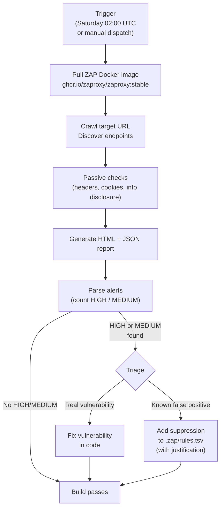

# OWASP ZAP Security Scan

[OWASP ZAP (Zed Attack Proxy)](https://www.zaproxy.org/) is an open-source Dynamic Application Security Testing (DAST) tool. It acts as an automated penetration tester — it crawls the application, sends malformed and adversarial requests, and reports security vulnerabilities it finds at runtime.

Unlike dependency scanning (which finds vulnerabilities in libraries), ZAP tests the running application itself — detecting things like missing security headers, exposed sensitive endpoints, cross-site scripting injection points, and SQL injection opportunities.

---

## What ZAP Scans For

ZAP's baseline scan checks for a wide range of vulnerabilities from the OWASP Top 10, including:

- Missing or misconfigured security headers (CSP, X-Frame-Options, HSTS)
- Exposed sensitive information (stack traces, server version headers)
- Cross-Site Scripting (XSS) reflection points
- SQL injection opportunities
- Insecure cookie attributes (`HttpOnly`, `Secure`, `SameSite`)
- Clickjacking vulnerabilities
- Information disclosure in error responses

---

## CI Schedule

ZAP runs automatically every **Saturday at 02:00 UTC** as part of `.github/workflows/security-scan.yml`:

```yaml
on:
  schedule:
    - cron: '0 2 * * 6'   # Saturdays 02:00 UTC
  workflow_dispatch:
    inputs:
      target_url:
        description: 'Target URL to scan'
        required: false
        default: 'https://staging.rcb.bg'
```

The scan targets `https://staging.rcb.bg` by default. Production is never targeted by the automated scan.

---

## Running ZAP Manually

### Docker (recommended — no local install needed)

```bash
docker run -t ghcr.io/zaproxy/zaproxy:stable zap-baseline.py \
  -t https://staging.rcb.bg \
  -r zap-report.html \
  -I
```

Options:

| Flag | Description |
|------|-------------|
| `-t <url>` | Target URL to scan |
| `-r <file>` | Output HTML report filename |
| `-I` | Do not return error code on warnings (only fail on FAIL rules) |
| `-c <config>` | ZAP configuration file (for rule customization) |
| `-z <opts>` | ZAP command-line options |

### Trigger the CI Workflow Manually

```bash
# Scan staging (default)
gh workflow run security-scan.yml

# Scan a specific URL
gh workflow run security-scan.yml --field target_url=https://staging.rcb.bg

# Scan production (use with caution)
gh workflow run security-scan.yml --field target_url=https://rcb.bg
```

### Full Active Scan (more thorough — use only in isolated staging)

```bash
docker run -t ghcr.io/zaproxy/zaproxy:stable zap-full-scan.py \
  -t https://staging.rcb.bg \
  -r zap-full-report.html
```

:::warning Active Scan vs Baseline Scan
The **baseline scan** (`zap-baseline.py`) is passive — it crawls and checks responses but does not attempt to exploit vulnerabilities. The **full scan** (`zap-full-scan.py`) sends attack payloads. Only run the full scan against an isolated staging environment that can be reset. Never run the full scan against production.
:::

---

## Alert Severity Guide

ZAP classifies findings into four severity levels:

| Severity | CI Behaviour | Action |
|----------|-------------|--------|
| **HIGH** | Build fails | Must fix before next production release |
| **MEDIUM** (treated as HIGH in our config) | Build fails | Must fix before next production release |
| **LOW** (WARN) | Build passes with warning | Review — fix or suppress with justification |
| **INFORMATIONAL** | Build passes | No action required — informational only |

The CI workflow uses `-I` flag so only explicitly configured FAIL rules block the build. See the `.zap/rules.tsv` section below for how rules are configured.

---

## Scan Flow



---

## False Positive Suppression

Not all ZAP alerts are real vulnerabilities. Common false positives for the RCB stack:

- **"X-Content-Type-Options header missing"** on Keycloak endpoints we do not control
- **"Server leaks version information"** on Traefik's default error pages
- **"Cookie No HttpOnly Flag"** on Keycloak's own session cookies (managed by Keycloak, not by us)

### `.zap/rules.tsv` Format

Create `.zap/rules.tsv` in the repository root. Each line specifies a rule ID, action, and reason:

```tsv
# ZAP rule configuration
# Format: rule-id<TAB>action<TAB>reason
#
# Actions: PASS (ignore), WARN (warning, don't fail), FAIL (fail build)

# 10020 - X-Frame-Options header not set
# Our Spring Security sets this on /api, but Keycloak endpoints are excluded
10020	WARN	Keycloak endpoints excluded from our header control

# 10021 - X-Content-Type-Options header missing
# Keycloak admin console endpoints — not in our control
10021	WARN	Keycloak admin endpoints

# 10038 - Content Security Policy header not set
# Applied to our API and SPA — Keycloak uses its own CSP
10038	WARN	Keycloak uses its own CSP configuration

# 90022 - Application Error Disclosure
# Spring Boot returns standard RFC 9457 Problem Detail responses, not stack traces
90022	WARN	Application uses RFC 9457 Problem Detail — no stack traces exposed
```

### Adding a New Suppression

1. Identify the ZAP rule ID from the report (shown in each alert detail)
2. Verify it is a genuine false positive by manual inspection
3. Add an entry to `.zap/rules.tsv` with a clear reason
4. Include a reference to the decision in the PR description

**Never suppress a HIGH or CRITICAL alert without a team review.**

---

## Reading the ZAP HTML Report

The generated `zap-report.html` is uploaded as a GitHub Actions artifact after each scan run:

```
Actions → security-scan workflow → run → Artifacts → zap-report
```

The report sections:

| Section | What to Look For |
|---------|-----------------|
| **Summary** | Total HIGH / MEDIUM / LOW / INFORMATIONAL counts |
| **Alerts** | Grouped by rule — expand each to see affected URLs |
| **Site** | Tree view of crawled URLs — check that key endpoints were reached |

If a key endpoint (e.g. `/api/v1/home`) is missing from the crawled site tree, ZAP may not have reached it. Check the target URL and whether the application was up during the scan.

---

## Integrating ZAP with Authenticated Endpoints

The baseline scan only covers public (unauthenticated) endpoints. To scan authenticated endpoints:

1. Generate a Keycloak token for a test user
2. Pass it as a Bearer token header using ZAP's `-z` option:

```bash
docker run -t ghcr.io/zaproxy/zaproxy:stable zap-baseline.py \
  -t https://staging.rcb.bg \
  -r zap-auth-report.html \
  -z "-config replacer.full_list\(0\).description=auth \
      -config replacer.full_list\(0\).enabled=true \
      -config replacer.full_list\(0\).matchtype=REQ_HEADER \
      -config replacer.full_list\(0\).matchstr=Authorization \
      -config replacer.full_list\(0\).replacement=Bearer\ TOKEN_HERE"
```

This is not yet automated in CI — it is a future hardening task.

---

## References

- [OWASP ZAP Documentation](https://www.zaproxy.org/docs/)
- [ZAP Docker Images](https://www.zaproxy.org/docs/docker/)
- [ZAP Rule IDs Reference](https://www.zaproxy.org/docs/alerts/)
- [Weekly Security Scan CI](./weekly-security-scan)
